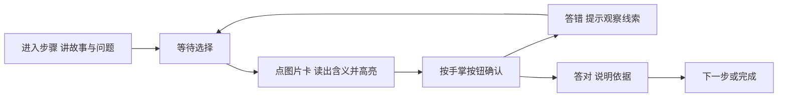
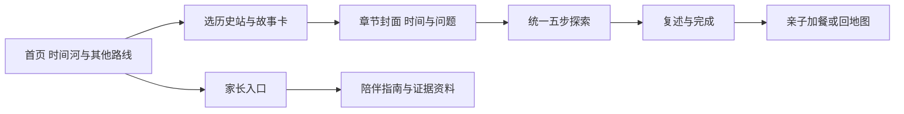
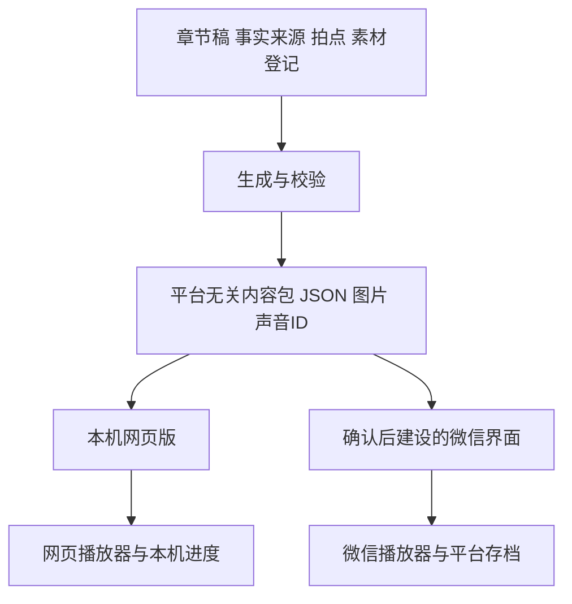

> 历史存档。当前规则以项目根AGENTS.md与docs/DESIGN-SPEC.md为准。

# 小小历史旅行团设计方案

> 当前实施范围已按用户后续要求聚焦秦汉至明清34章，其他69章在HTML隐藏、源稿保留。逐题实现以 `content/focused-quests.json` 和 `docs/FOCUS-REBUILD-PLAN.md` 为准；本文件的全库设计或旧里程碑继续作为后续建设参考。

整体产品设计与任务制作规范

方案版本：2.0　编制日期：2026年9月12日　适用对象：产品、内容、美术、配音、开发与测试

《小小历史旅行团》是一款面向4—6岁儿童与家长共学的历史游戏。孩子带着一张旅行地图，走进不同历史时期，围绕具体人物、物件、地点或作品完成五步探索。每个任务让孩子发现一件事，尝试说清它怎样发生，并认识支持这个故事的证据。

本方案规定产品应如何组织、每个任务应怎样制作、儿童页面应怎样呈现，以及制作需要的来源、素材和工具。主线通过图片、短语音和点按完成，识字能力不作为进入或完成任务的条件。详细史料、争议和编辑资料留在家长层；会影响理解的证据身份直接让孩子看见、听见。

设计采用七个内容板块、103个首期任务与统一的“时间—起点—旅程—变化—回答”结构。先在本机网页版验证内容和体验；完成内容确认、正式配音与本机玩法验收后，再转换微信小程序。本方案不包含公网发布、登录或支付的实施授权。

## 1 产品整体设计

### 产品目标

一场小旅行围绕一个具体问题展开，例如“为什么要用同一把尺”“印章上看不懂的符号怎么办”。孩子不需要先了解一个朝代的全部历史，也不需要背年份，便能观察、听讲、选择和复述。故事结束后，地图留下完成印记，孩子可以换一站、重玩或休息。

产品同时服务三类使用者。儿童获得可自己操作的短体验；家长获得陪伴提问和解释依据；编辑与制作人员获得可追溯的内容、图片、声音和验收记录。

| 使用者 | 要完成的事 | 产品提供的帮助 |
| --- | --- | --- |
| 儿童 | 找到故事、听懂一个问题、观察、选择、表达发现 | 会说话的图片卡、大按钮、明确的下一步、可暂停重听 |
| 家长 | 陪伴、了解学习目标、听孩子复述、做线下活动 | 一句话目标、两三个提问、难词解释、证据说明 |
| 制作与审核人员 | 制作同一任务的内容、页面、素材与声音 | 任务卡、事实来源表、逐页分镜、素材工单、校听与测试表 |

### 旅行世界与角色

首页是一处旅行集合点：地图、时间河、三位小旅伴和正在等待探索的线索。三位旅伴可分别承担带路、观察和提问的功能，造型与声音保持稳定；名字和具体形象在美术定稿时确定。角色只承担产品引导，不替真实历史人物作证。

孩子获得的是“发现了什么”的旅行印记。完成一章可回看时间、地点、核心证物与自己的复述提示，不设置文明排名、阵营胜负、伤亡得分、随机奖励或连续打卡压力。地图允许自由探索，跨学科任务可提示适合先听哪些故事，但不强制锁住内容。

主线设计预算为每次约5—8分钟，亲子扩展约2—5分钟，并支持分次完成。该预算用于限制稿件和页面负担，应由儿童实测调整，不作为必须完成的时长。

## 2 课程地图与任务体系

### 首期范围

| 板块 | 任务数 | 内容组织方向 | 导航方式 |
| --- | ---: | --- | --- |
| 中国古代史 | 43 | 早期人类、聚落、国家、生活、技术与文化 | 中国时间河前13站 |
| 中国近代史 | 14 | 外来侵略、抵抗救亡、社会变化与革命进程 | 中国时间河中间6站 |
| 中国现代史 | 10 | 新中国成立、建设探索、改革与社会生活 | 中国时间河后4站 |
| 世界古代史 | 10 | 多地文明、城市、制度、信仰与知识 | 独立世界古代路线 |
| 世界近代史 | 10 | 海路、社会变革、工业、权利与文化 | 独立世界近代路线 |
| 世界现代史 | 10 | 战争与和平、发展、独立与全球联系 | 独立世界现代路线 |
| 跨学科主题 | 6 | 人物、钱币、交流、交通、环境与书法 | 跨时代主题入口 |

中国史采用中国课程标准、统编教材结构与中国权威机构材料作为主体脉络。课标与教材帮助组织知识范围，不能把初中教材的句式、知识密度和考核要求直接搬给4—6岁儿童。统编教材重视时序、空间联系和具体史事之间的关系，本产品据此组织内容，再做低龄改编。[教育部课程标准发布入口](https://www.moe.gov.cn/srcsite/A26/s8001/202204/t20220420_619921.html)；[人民教育出版社教材说明](https://www.pep.com.cn/xw/zt/hd/12/zbtjc/202411/t20241118_1996860.html)。

中国时间河包含23站。秦、汉、隋、唐、五代十国、宋、元、明、清分别建设；宋站用不同时间片表达辽、两宋、西夏、金先后并立，不画成宋的下属或单线接替。清站到1840年前是课程划分，不表示清朝于1840年结束。

世界史有自己的时间线，不作为中国史的附录；中国史也不写成欧美史附录。只有确有同期关系或往来证据，才在章内提供对照。跨时代主题独立标明时间跨度。河流长度和站点间距只用于导航，不冒充真实时间比例。

### 一个任务的学习边界

“任务”是一个完整故事单元，对应一个稳定章节ID。一个任务内有五个学习步骤，封面和完成页是任务的外壳；图片大图是覆盖层，亲子加餐是延伸。不能把封面、五步、加餐分别计成独立课程。

每个任务的主线保留一个核心问题、一个具体入口、三条连续内容拍点和一句带走的话。涉及多个时代、多位人物或多个国家时，只保留回答核心问题所需的线索，其余内容交给家长展开。103个任务逐一列入配套任务卡，便于按章分配制作。

## 3 每个任务怎样组织内容

### 三层内容

| 内容层 | 放什么 | 不让它承担什么 |
| --- | --- | --- |
| 儿童主线 | 时间位置、具体对象、三条故事拍点、一个回答 | 不讲完整研究综述，不堆积术语和年份 |
| 亲子扩展 | 难词解释、两三个追问、诗文连接、线下活动 | 不成为完成任务的额外门槛 |
| 编辑证据 | 事实卡、出处定位、材料身份、争议与不确定性 | 不用资料数量代替事实支持关系 |

研究人员先做事实底稿，再选出儿童主线。不能先编一段热闹故事，随后找同朝代图片给它作证。主线可以运用学习模拟和虚构旅伴，但必须说明模拟在帮助理解什么，以及哪些细节不是历史记录。

### 每个任务的制作包

| 模块 | 必须填写的内容 | 完成标准 |
| --- | --- | --- |
| 任务定位 | ID、板块、时代、地点、儿童标题、核心问题 | 标题有具体对象，问题一章能回答 |
| 学习结果 | 孩子可指认的对象、可解释的变化、带走句 | 观察和复述能检验，不写“了解很多知识” |
| 主线内容 | 时间定位、先、接着、最后、回答 | 每一步接住前一步，不跨材料硬拼因果 |
| 事实依据 | 核心事实、来源ID、原文位置、改编句、支持范围 | 每个可核查断言都有直接依据 |
| 页面分镜 | 本屏看见什么、听见什么、做什么、得到什么反馈 | 一屏一个学习意思、一个主要操作 |
| 素材清单 | 证据图、学习示意、选项图形、声音、许可与边界 | 每项知道从哪来、放哪里、谁制作 |
| 亲子说明 | 目标、追问、容易误解处、可选加餐 | 家长无需先读研究长稿才能陪伴 |
| 验收记录 | 事实、图意、声音、操作、复述问题及修订 | 有实际记录后才能标记通过 |

模板见 [任务制作模板](design/TASK-TEMPLATE.md)。各任务的事实和素材入口见 [103个任务设计索引](TASK-DESIGN-INDEX.md)。模板和任务卡属于设计层文件，制作确认后的正式内容再写回章节稿及来源、素材登记。

### 五步内容分工

| 步骤 | 内容任务 | 画面与声音 | 儿童操作 |
| --- | --- | --- | --- |
| 时间 | 知道故事位于哪个时代与地方 | 高亮时间站、地点图形；语音说出时代 | 按语音点到对应时代图形，不考认数字 |
| 起点 | 认识对象与最初的问题 | 文物、人物、地点或作品；一个观察点 | 找同一件线索或点一个清楚细节 |
| 旅程 | 看见行动、过程或材料的下一层 | 一段行动或观察变化，不同时讲多条线 | 选择符合本段的行动图，或完成可点击的匹配 |
| 变化 | 发现结果、关系或认识上的变化 | 前后对照、方向箭头或证据比较 | 选择能被本段支持的解释 |
| 回答 | 把线索接回核心问题 | 一句总结和少量图形线索 | 作出最后判断，再尝试口头或指图复述 |

统一五步不等于五个固定句式。诗歌任务按诗中的观察、动作和感受推进；档案任务按记录及其边界推进；技术任务按问题、改进与协作推进。不得要求每章都出现某人“来到这里”，也不能把所有材料都强写成单一原因造成单一结果。

一个步骤的编辑分镜固定填写六项：画面焦点、儿童短句、旁白、问题、选项或操作、反馈。旁白不逐字重复整个页面；反馈解释依据，不只说“真棒”或“错了”。

## 4 内容来源与证据组织

### 来源分工

| 要查的内容 | 优先来源 | 使用方式 |
| --- | --- | --- |
| 中国史整体顺序与主题 | 教育部课程标准、统编教材及官方教学说明 | 组织范围、前后脉络与称谓 |
| 中国文物与遗址 | 国家级和省级博物馆、考古研究机构 | 核对名称、年代、出土与馆藏信息、学术解释 |
| 中国近现代史 | 档案馆、政府与权威党史资料、纪念馆原始记录 | 核对事件、文件、责任与普通人经历 |
| 世界史对象与事件 | 相应国家博物馆、图书馆、档案馆、大学馆藏、UNESCO | 使用对应地区原始材料，保留机构解释范围 |
| 诗文与书画 | 教材出版机构、权威版本、收藏机构作品记录 | 区分作品文本、作者生平与后世图像 |
| 图片许可 | 图片原始文件页、馆藏开放政策、作者授权 | 只解决图像使用身份，不代替历史证据 |

商业媒体、旅游文章和百科整理可帮助发现线索，不直接支撑儿童正文。搜索摘要只能定位材料，引用应回到原文。链接失效时保留原记录并寻找同机构替代页；读不到原文的关键说法不能仅凭标题定稿。

### 从事实到页面的对应链

制作人员为每条关键事实建立“原始材料—事实卡—儿童改编句—步骤—图片与声音”的对应。记录来源ID、机构、标题、网址、章节或页码、核对日期，以及原文能支持和不能支持的内容。意见、推断、文学表达和学习模拟单独标明。

同一来源可以服务多个步骤，同一张文物图也可以重复；但每次必须说明它在本步支持什么。仅有同朝代、同地点或相近词语，不能视为证据对应。来源表、图片许可表与儿童适宜性表分别检查。

| 字段 | 示例或填写要求 |
| --- | --- |
| 事实ID | 任务ID下的稳定事实编号 |
| 原始材料 | 机构、标题、来源ID与具体段落位置 |
| 支持的说法 | 用自己的话写出原文直接支持的事实 |
| 儿童表达 | 保留意义和限定条件的短句 |
| 表达性质 | 事实、机构解释、合理推断、文学表达、学习模拟 |
| 页面关联 | 对应五步中的哪一步，以及旁白与图片工单 |
| 限制 | 不能推出的人物、动机、范围、时间或细节 |

逐任务卡保留来源查询入口和带引用的事实底稿。卡中的资料候选不能自动当成每个新分镜的完整支持；进入文字冻结前，编辑必须把本步具体说法对应到原文位置。

## 5 面向不识字儿童的体验

### 先解决能否理解和操作

图片并不天然能被孩子理解，喇叭、暂停、地图等图标也需要在实际操作中教会。产品用一次简短语音加一次动作演示建立规则，随后在所有页面保持相同含义和位置。

| 场景 | 设计做法 | 应观察的结果 |
| --- | --- | --- |
| 第一次进入 | 一个显眼出发按钮；点后播放短引导 | 孩子无需家长读说明就能开始 |
| 选择时代 | 站点用具体地标或物件；点按说出时代名 | 不靠识别朝代文字和年份找入口 |
| 选择故事 | 大图是入口，整张卡可点；朗读短标题 | 孩子能把听到的故事与卡片对应 |
| 听题 | 先讲画面，再单独读问题；当前焦点同步高亮 | 听完知道要看哪里、做什么 |
| 选答案 | 默认两张语义明确的图片卡；点卡朗读其含义 | 不靠读文字、一二三序号或最长选项猜答案 |
| 确认选择 | 点卡先选中，再点固定位置的手掌确认按钮 | 减少误触直接判错，听懂后再提交 |
| 不会操作 | 第一次在真实任务上示范“点图、听、选好啦” | 学到可重复使用的操作方式 |
| 答错 | 保留上下文，指向线索，温和解释并可重试 | 知道如何再看，不被突然音效吓到 |
| 想重听 | 重听、暂停图标固定；短语音解释功能 | 可自主控制速度，不必赶上自动播放 |
| 不会说整句 | 可用指图、动作、补一个词表达 | 不把口语长度当作历史理解能力 |
| 想离开 | 熟悉的返回图标；保留进行中步骤 | 允许休息，下次能接着玩 |
| 找家长资料 | 底部独立家长入口 | 儿童主线不被长文、来源或设置打断 |

两张选项图是首版默认。确实需要三个选项时，先确认三张图可清楚区分且屏幕放得下，再使用同一组件扩展。选项数量改变不能改变核心事实或把复杂问题变成显而易见的装饰题。

### 一次选择的完整声音和状态

点选项时暂停原问题声音，播放该卡的短解释；孩子可以换卡再听。未选中时，确认按钮不可提交，点到它时播放一次“先点一张图”的提示。提交后只读当前反馈。下一步由孩子主动点，不因音频结束自动跳走。

页面无操作时可在约10秒后给一次轻提示，提醒哪处能点；连续提示应可关闭，不循环催促。孩子答错后不要求等一段很长的讲解才能重试，也不把连续乱点视作已经理解。

### 图形与文字的关系

儿童主标题宜用4—12个字，问题短句宜在20字左右，具体取决于语义是否完整。正文块上限90个汉字，第一屏时间节点合计不超过120字；核心任务的短故事与选项各不超过48字。上限只用于拦截过载，设计不能以填满字数为目标。

图形承担对象和动作辨认，声音承担提问和解释，文字帮助家长陪读。颜色同时配合轮廓、位置和状态符号，不单独表示对错。以图作答也不能通过服饰、肤色和面孔猜民族、国籍、贫富或立场。

## 6 页面组织与导航设计

### 整体路径

所有任务共用这条路径。地图、排序、声音等扩展只作为步骤内的通用组件，不为某章另建进入逻辑。中国时间河、三条世界路线与跨学科区域分别可辨认；站点详情给出时代与地点，避免把整站画成同一天的场景。

### 页面规格

| 编号 | 页面 | 内容组织 | 主要操作与声音 |
| --- | --- | --- | --- |
| P01 | 旅行集合首页 | 旅伴、地图、出发、上次故事 | 点出发后听引导；可继续或自由选站 |
| P02 | 历史站与故事卡 | 时代名、具体对象卡、完成标记 | 点卡听短标题并进入封面 |
| P03 | 章节封面 | 时间定位、一个入口、一句问题 | 自动读短介绍；一个明显开始按钮 |
| P04 | 五步任务页 | 当前图片、故事焦点、一个问题、选项 | 看图、重听或暂停、选中、确认、下一步 |
| P05 | 图片观察覆盖层 | 完整图片、对象身份、观察点 | 听说明、看局部、关闭回原步骤 |
| P06 | 复述与完成 | 问题回顾、两三张图形线索、完成印记 | 先尝试复述，再主动听完整答案 |
| P07 | 亲子加餐 | 单项活动的材料、动作与追问 | 线下动手；家长可勾选 |
| P08 | 家长指南 | 一句话目标、容易误解处、问题与难词 | 读陪伴提示、找来源、管理本机记录 |
| P09 | 编辑资料页 | 原稿、事实、出处、素材、语音与审核 | 逐章逐步定位问题，不在儿童层执行审核 |

### 五步页面的屏幕分区

下图是布局分区示意，图片占位和选项占位均需替换为本任务素材。手机上从上到下保持返回与进度、图片、问题、声音控制、选项、确认。桌面改为图与操作区并排，但每一步位置保持稳定，不左右交替跳动。

主触控区建议至少56像素高，主要选择卡建议至少96像素高，相邻控件留8—12像素。核心任务以一屏完成为目标；小屏、大字体或辅助操作时允许有秩序地滚动，不能裁掉问题和提交按钮。首版设计以390×844手机与1440×900桌面为主，补查360×740与平板。

这些尺寸是儿童原型设计目标，不是“满足尺寸就适合儿童”的保证。网页基础检查可参照W3C关于目标尺寸和间距的说明；自动播放声音必须有清楚的控制入口。[目标尺寸说明](https://www.w3.org/WAI/WCAG22/Understanding/target-size-minimum.html)；[声音控制说明](https://www.w3.org/WAI/WCAG22/Understanding/audio-control.html)。

## 7 通用玩法与任务差异

### 首版共同能力

首版核心采用“看证据—听问题—点图片卡—确认”的统一操作。证据图片可放大，声音可暂停、续播和重听；完成页支持指图复述。每个步骤都可判断、可重试，判断依据保存在内容数据中。

| 组件 | 适合的学习任务 | 低龄操作与边界 |
| --- | --- | --- |
| 图片选择 | 对象、行动、结果、证据解释 | 两张卡优先；图形与声音共同表达 |
| 证据观察 | 文物细节、手稿层次、遗址结构 | 点明显区域；小细节提供放大按钮，不要求精准命中 |
| 前后对照 | 改进、变化、作品动作与生活差异 | 两幅图位置固定，一次只改变一个关键点 |
| 时间片地图 | 同期并立、路线方向与范围 | 点大节点切换；同时说清时代，不让拖线代替事实 |
| 点选匹配 | 工序、人物协作、工具与任务 | 先点物件再点位置，提供拖拽的点按替代 |
| 声音比较 | 有可用材料的声音、节奏或信号 | 一次只播一段；现代演示不标作古代原声 |

地图、匹配或声音比较只在学习目标确实需要时建设，并先用不同板块的代表任务验证。不会因为“题材很多”就制作103套不同游戏。资料不足的流程、速度、价格、人物动机和精确路线不能由交互系统补造。

### 任务类型的表达重点

文物任务先让孩子观察形状和用途，再连接历史问题；人物任务同时讲协作者与时代条件；技术任务表现改进、维护和使用条件；诗文任务表达作品中的动作与感受；地图任务区分时间片和空间关系；档案任务说明记录者、记录内容与沉默部分。跨学科任务保持一个具体问题，使用不同证据互相核对，不一次复习整条历史线。

战争与灾难题材采用文件、普通生活、遗址今景和纪念物，准确解释责任与后果，避开刺激画面和声效。火药等技术通过书籍、记录与用途边界讨论，不设计配方、混合、点火或武器操作。

## 8 视觉系统与素材清单

### 视觉方向

整体采用明亮、温暖的旅行绘本风格。地图和插画邀请孩子进入；真实证据保持清楚、可辨认，不套复古纹理、戏剧光影或夸张表情。文字与按钮底色干净，装饰避开观察区域。

基础色可采用奶油白、深墨绿、河流蓝与暖红，黄色用于焦点和完成印记。先确定一套色彩、字阶、圆角、线条、阴影和图标尺度，再应用到全库。不要为不同朝代任意更换按钮语义或操作位置。

### 全局素材包

| 素材 | 规划范围 | 制作要求 |
| --- | --- | --- |
| 旅伴角色 | 3位角色，分别准备招呼、指路、观察、思考、鼓励、休息等姿态 | 比例、服装与轮廓一致；注明虚构引导角色 |
| 首页与时间河 | 1套集合场景、地图底图与可伸展河流组件 | 不用不可点击的装饰冒充入口 |
| 路线与站点图标 | 23个中国站、3个世界板块、1个跨学科入口 | 小尺寸仍可分辨，与站点语音绑定 |
| 五步标记 | 时间、起点、旅程、变化、回答各1个 | 图形固定；亮起表示当前位置 |
| 操作图标 | 出发、返回、播放、暂停、重听、帮助、确认、关闭等 | 统一符号与声音教学；可见焦点 |
| 反馈与完成 | 选中、可再试、完成状态与旅行印记 | 温和短暂，不以炫目动画强留儿童 |
| 证据身份组件 | 文物、档案、遗址今景、后世作品、复原、学习示意等 | 图形标签配预生成短说明 |

### 每个任务的素材包

| 类别 | 每任务需要填写的槽位 | 制作或获取方式 |
| --- | --- | --- |
| 记忆入口 | 1张可辨认的封面对象 | 已清权照片、作品图或清楚标明的自制图 |
| 主线图片 | 5个步骤图片槽位 | 按本步意义选图，可复用同一证据的不同观察点 |
| 选项图形 | 每步2—3个，合计10—15个逻辑槽位 | 从已清权图像取局部或制作简单行动示意 |
| 复述线索 | 1组2—3张提示图 | 复用任务核心对象、过程与结果 |
| 地点与时间 | 时代站点、必要的地点图 | 复用全局组件，必要地图单独人工核对 |
| 可选扩展 | 课本连接、纸卡、对照图或加餐材料 | 不为凑数量新增 |
| 声音 | 介绍、五步故事与问题、选项、反馈、图片说明、结束回答 | 逐段预生成并绑定稳定ID |

槽位不是新增文件数量。103任务对应515个主线图片位置，同一张强相关证据可重复使用；图像和声音都按身份与内容去重。制作估算应分别统计可直接复用、需调整、需新作和待许可素材，不能简单按515张新图计算。

### 素材技术与证据要求

照片和作品保留原始文件，不改变文物关键细节；运行图按显示尺寸生成，主图优先准备足够清楚的横竖版本。自制学习示意保留可编辑源文件，地图和文字优先用SVG分层制作。新绘图不把文字直接烧进背景，便于改稿和无障碍说明。

低清史料只作小型证据卡，限制放大，不要求孩子辨小字。裁切前确认不移除改变解释的上下文；对历史照片的涂改、复原和生成补全不能当作原始证据展示。

每项素材登记ID、题名、来源页、作者、年代或拍摄时间、馆藏或出土信息、许可、修改记录、本地路径、儿童可见性、证据边界和所用步骤。未清权材料仅供研究。生成图可以做旅伴、导航和学习示意，不能生成“真实文物照片”或替代史料。

## 9 语音设计与制作

### 声音承担哪些工作

孩子点“出发”后，产品开始本次语音引导。旁白讲故事；提问声明确任务；选项声解释卡片；反馈声解释依据；图片说明告诉孩子看到的是什么、它与本步有何关系。角色声音可以有差别，但不能因角色数量增加理解负担。

每段只承担一个意思。故事和问题分别录制；人名、地名、年代、单位和多音字先建立读法表。单段上限90个汉字，优先拆成可在一次观察内听完的短段。具体音色、语速、停顿与音量以同一组材料试听后冻结。

| 槽位 | 逻辑数量 | 对应内容 |
| --- | ---: | --- |
| 任务介绍与结束回答 | 2 | 介绍问题、回到带走句 |
| 每步故事、问题与图片说明 | 15 | 五步各3段 |
| 每步选项 | 10—15 | 五步各2—3段 |
| 每步对错反馈 | 10 | 五步各2段；必要时细化到具体错因 |
| 通用操作与可选内容 | 按需 | 共用引导、帮助、课本桥梁、亲子扩展 |

单任务基础需求约37—42个声音逻辑槽位，不等于37—42个必须新合成的文件。相同文字可复用声音ID，同一图片在不同步骤的解释则可不同。新增暂停、选择和失败提示等通用声音全库共享。

### 播放与生产规则

同一时刻只播一段前台声音。暂停保存播放位置，续播从暂停处继续；重听从当前段开头开始；切页停止旧声。自动播放被拦截或文件失败时，给出可点的声音按钮与简短提示，不让“正在讲”状态一直挂着。

合成与播放是两件事：可联网生成音频，再把生成文件放到本机播放。生产阶段保存无损母版或供应商原始输出，发布时生成适配平台的压缩版本；响度、峰值余量、首尾静音与停顿统一检查。现代配乐、后人演奏和重制声音必须标明，不能叫古代原声。

工具可先用项目已有的 `edge-tts` 流程制作试听与本机样本。该项目调用在线语音服务，不能写成离线合成器；正式批量制作应先选定适合生产的服务或真人配音方案。[edge-tts项目说明](https://github.com/rany2/edge-tts)。

文字、读音和声音参数未冻结前，只做必要小样与本机验证。批量生成先写暂存文件，全部成功后替换；失败不能损坏旧音频。最终交付文字清单、声音ID、参数、版本、文件与校听记录。

## 10 任务样例与来源对应

### 样例一 秦朝为什么要用同一把尺

学习目标是理解“用同一标准更容易比较”。用今天的纸条作学习模拟，随后看秦代实物和诏文说明这是一项历史制度。模拟纸条不叫秦尺，不用现代尺的厘米值冒充秦代单位。

历史依据采用中国国家博物馆的秦汉陈列与双诏版记录。馆藏记录说明秦统一度量衡诏书及其后来补刻；儿童主线只取共同标准这一重点。配图时应核对具体器物身份，诏版、铁权和钱范不能混成同一件文物。[秦始皇秦二世双诏版](https://www.chnmuseum.cn/zp/zpml/csp/202008/t20200826_247416.shtml)。

| 步骤 | 画面与内容 | 语音制作稿示例 | 儿童操作 |
| --- | --- | --- | --- |
| 时间 | 秦站亮起；今天的尺与秦代器物分开 | “我们去秦朝，看看古人怎样约定量东西的办法。” | 按声音点秦站图形 |
| 起点 | 同一条纸带旁，两把刻度间距不同的学习尺 | “这两把学习尺不一样，量出的数也会不同。先看看它们。” | 点出刻度间距不同的那一对 |
| 旅程 | 两把相同学习尺对同一纸带量取；旁边出现器具校对示意 | “大家照着同一个标准来量，比较起来就方便多了。” | 选两把标准一致的图 |
| 变化 | 秦代器物照片与诏文位置；无需读字 | “秦朝把共同标准写进诏文，还要有人把它落实到器具上。” | 选择“共同标准＋大家使用”的图形解释 |
| 回答 | 同一纸带、相同学习尺、多人合作三条线索 | “标准相同，比较更方便；执行标准还要许多人一起做。” | 完成最后判断，再指图复述 |

需要的素材是已清权秦代器物照片、两套纸带与学习尺示意、刻度观察图、器具校对的自制示意、时代图标与对应短声音。正误反馈应围绕“刻度间距是否一样”，不根据尺子的颜色判对错。历史判断来源与今天的量尺实验分别注明。

### 样例二 李白怎样把月光写进四句古诗

记忆入口是《静夜思》。五步依次定位唐代、看月光、观察疑霜与抬头、连接低头与故乡、说出动作和思念怎样连起来。诗句来自权威文本，后世画像只帮助认识诗人形象，不充当李白当晚的照片。具体写作地点与“床”的解释不在儿童层指定唯一答案。[《静夜思》文化资源](https://m.ccdi.gov.cn/content/ac/4f/23528.html)。

素材采用诗句排版、月光与动作学习示意、已核身份的后世作品；每一步都说明是在读诗。不能为换图加入只因同属唐代的大雁塔或钱币。互动可让孩子选择“抬头看月亮”“低头想故乡”的动作图，诗句可听，不要求认字。最终通过指图和动作复述，不要求背诵整首诗。

### 样例三 一枚还读不懂的印章

学习目标是区分“能观察到”与“还不知道”。时间定位到古代印度河城市；起点看印章图案；旅程比较原印章与现代压印；变化回到城市遗址与可见设施；回答说明能观察形状与城市线索，但不能替未充分释读的文字编译文。

大都会艺术博物馆藏品49.40.1的记录标明印章年代约为公元前2600—前1900年，并把现代压印与古物并列说明；记录指出印度河文字尚未被充分释读。UNESCO遗址记录提供城市规划依据。两种来源分别回答对象与城市问题，不由印章直接推断管理者姓名。[印章及现代压印记录](https://www.metmuseum.org/art/collection/search/324062)；[摩亨佐达罗遗址记录](https://whc.unesco.org/en/list/138/)。

素材需要印章与现代压印图、带身份说明的遗址图片、可看见与待研究的图形标签。两张选项可表达“这里有一些符号”和“已经知道某个人的名字”，由声音读出含义；不让孩子自己辨认印度河文字。任务保留问号也算有价值的发现。

## 11 制作需要的工具

工具按产物选择。必需的是可追溯的文字、图片、声音、原型和验证流程；购买设计平台或接入新的在线服务不是本机内容制作的前提。

| 环节 | 工具选择 | 产出与使用边界 |
| --- | --- | --- |
| 资料查找 | 浏览器、机构站内检索、PDF阅读器 | 来源页、原文定位与事实卡；不用搜索摘要替原文 |
| 内容编写 | Markdown与JSON编辑器、项目校验脚本 | 章节稿、来源和素材登记；AI辅助压缩后人工逐句复核 |
| 页面与交互 | Figma用于协作原型；也可先用纸面线框与本机网页 | 组件、状态、页面连接与分镜，不把图稿当实现完成 |
| 图形与地图 | Inkscape等矢量编辑器 | 图标、可编辑地图与学习示意；年代和边界人工核查 |
| 旅伴与插画 | 图像生成工具或插画师，配合统一角色参考 | 仅用于虚构角色、导航与标明的艺术表现 |
| 图片处理 | 项目缩略图脚本、常规图片编辑工具 | 等比缩放、合适裁切、压缩与导出，保留原图 |
| 语音样本 | 项目生成脚本、edge-tts；正式服务或真人配音另行定音 | 预生成声音与文字清单，合成可能需要联网 |
| 音频检查 | Audacity、FFmpeg与ffprobe | 听段落、检查时长、格式、音量和首尾静音 |
| 网页实现 | 项目既有React、Vinext与Vite流程 | 统一页面、任务组件、播放器、本机存档 |
| 自动验证 | Node测试、内容门禁，页面行为可用Playwright | 全库结构、资源、交互与截图记录 |
| 儿童验证 | 实际设备、纸面或本机观察表 | 开始、操作、误解与复述记录；不需要在线识别 |

Figma适合连接页面与预演交互，Inkscape适合编辑矢量图形，Audacity用于音频制作与检查，FFmpeg工具链用于媒体处理；Playwright的视觉比较可作为界面回归检查的一部分。[Figma原型说明](https://help.figma.com/hc/en-us/articles/360040314193-Guide-to-prototyping-in-Figma)；[Inkscape教程入口](https://wiki.inkscape.org/wiki/TutorialsAndHelp)；[Audacity](https://www.audacityteam.org/)；[FFmpeg文档](https://ffmpeg.org/documentation.html)；[Playwright视觉比较](https://playwright.dev/docs/test-snapshots)。

上述工具按制作需要使用，方案不要求全部安装。图像生成工具不参与判定史实、精确地图和图片许可；语音工具不参与判定儿童理解；浏览器测试不能代替儿童试玩。

## 12 实现结构与数据交付

### 内容和平台分层

内容层保存时间、人物、事实、儿童稿、声音文本、图片身份和判断依据。界面层负责显示、触控、播放、动画与进度。任务内容不写进React组件或微信专有页面。各任务通过相同组件读取同一结构的数据。

### 任务数据需要表达什么

| 对象 | 必需字段 | 设计用途 |
| --- | --- | --- |
| 任务 | taskId、trackId、period、coreQuestion、learningOutcome | 导航、定位与学习目标 |
| 五步分镜 | stepId、learningPoint、screenText、narration、prompt、interaction | 页面组织与操作 |
| 选择项 | optionId、visualRef、spokenLabel、correct、feedback | 不依赖识字的听选与解释 |
| 证据关联 | factIds、sourceIds、assetIds、evidenceBoundary | 将可见内容接回事实与材料 |
| 声音 | voiceId、textVersion、audioRef、role | 稳定绑定与替换 |
| 素材工单 | assetNeedId、purpose、reuseCandidates、productionBrief、review | 告诉美术做什么、何时能用 |
| 进度 | taskId、stepId、contentVersion、completed | 本机继续、重玩与版本恢复 |

这些是设计数据要求，不要求把现有字段全部重命名。实现时优先复用已有章节ID、步骤ID、素材ID与声音ID，用转换层补齐视觉选项、出处定位和审核记录。配套 `task-specs.json` 用于设计制作，不直接替换儿童运行包。

### 模块划分

统一实现首页地图、故事选择、封面、任务容器、图片观察、完成页、家长指南和编辑资料。任务容器处理选中、提交、反馈与下一步；声音服务处理独占播放、暂停和失败；进度服务保存本机状态。地图与对照等组件在容器内扩展，不另起一套进度。

首页索引与章节内容分开加载；按章预取图片与短声音，避免首次打开就加载全库媒体。本机运行仍需要本地服务和事先准备好的依赖与媒体；完整离线安装、跨设备同步和公网缓存若将来需要，应分别设计和验证。

只保存必要的本机完成与进行中状态。家长可以清空记录；无法保存时应提示并允许继续体验。不要求儿童账户，不采集姓名、生日或录音。内容审核通过与儿童完成进度分别记录。

## 13 从设计到制作的工作流程

### 每个任务的生产顺序

1. 确定时代、核心问题和可观察入口，删掉本任务无法回答的支线。
2. 查阅原始材料，形成带出处位置的关键事实卡，写清不知道什么。
3. 写五步分镜：每屏看什么、听什么、做什么、凭什么判断。
4. 制作无识字原型，用示意卡验证孩子是否能理解对象与操作。
5. 锁定图片用途，查许可、选图或开新图工单；逐步核对图文语义。
6. 写短声音与读音表，制作代表小样，检查节奏和停顿。
7. 在统一组件中实现，校验图片、声音、选择与进度状态。
8. 进行儿童试玩；按观察修改内容、图形或操作，共性问题回查全库。
9. 完成逐章审核，用户确认文字与内容版本后冻结。
10. 生成正式声音、逐段校听，完成第二轮代表玩法验证，再进入平台转换评审。

不要在分镜仍大改时批量生成所有图和正式声音。可以先用少量代表任务把模板做通，再批量应用；模板的可用性与每章内容是否正确仍分别验收。

### 各角色收到什么并交出什么

| 角色 | 输入 | 输出 |
| --- | --- | --- |
| 产品与交互 | 学习目标、任务卡、儿童观察 | 页面与状态、操作规范、任务范围 |
| 内容编辑 | 权威来源、事实卡、核心问题 | 五步内容、儿童短句、家长解释、边界 |
| 美术与素材 | 分镜、素材工单、角色规范 | 图形、证据排版、许可登记与源文件 |
| 配音 | 冻结短稿、读音表、画面节奏 | 稳定ID音频、参数与校听记录 |
| 开发 | 内容数据、组件状态、素材与声音清单 | 可玩的统一实现及异常恢复 |
| 审核与测试 | 可玩版本、来源与验收表 | 问题位置、复核结果、真实儿童观察 |

任务分配应精确到任务ID与步骤ID。修改一条事实时同时检查相关画面、问题、选项和声音；修改一个公共组件时回查全库使用位置。原始史料缓存不放入普通Git，代码与内容登记可以跟踪版本。

## 14 验收标准与实施批次

### 一个任务怎样算设计完整

每个任务必须交付核心问题、五步分镜、逐句事实依据、图片工单与许可、选项图形含义、声音文本与触发、家长提示、异常状态和验收记录。只有文字或效果图不算任务设计完成；没有最终图片和声音时要明确标记待制作槽位。

| 验收项 | 应看到的证据 |
| --- | --- |
| 时间与脉络 | 首先定位时代，三条拍点相连，跨时段关系不混淆 |
| 事实与来源 | 关键断言能回到原文位置，文学、推断和模拟分别标明 |
| 图片 | 身份、许可、儿童适宜性与本步意义都成立 |
| 声音 | 与画面、提问和选项一致；可暂停、续播、重听，无漏错段 |
| 不识字操作 | 不读任何正文也能找到开始、听懂选项、确认和返回 |
| 交互价值 | 操作检验观察、时间、位置、过程或证据，答错可解释重试 |
| 家长支持 | 能找到目标、追问、来源和本机记录管理 |
| 儿童复述 | 记录孩子自己的话、动作或指图，不用家长提示后的答案冒充独立理解 |

观察表记录匿名编号、年龄段、设备、任务与步骤、家长帮助程度、重听和跳过位置、误解与原话。首轮覆盖不同年龄和识字程度；出现共性问题就回查103个任务。代表章的成功不能替代其余任务的逐章审核。

### 实施批次

| 批次 | 重点产物 | 进入下一批的条件 |
| --- | --- | --- |
| A 整体与模板 | 页面图、交互状态、任务模板、素材规范 | 各角色知道同一任务怎样制作 |
| B 代表任务 | 文物、诗文、地图、技术、近现代与世界史原型 | 同一套操作可用，儿童问题已有记录 |
| C 全库制作 | 103任务分镜、来源、图片与本机声音 | 全库结构与图文对应检查，有返修记录 |
| D 内容确认 | 逐章八项验收与冻结清单 | 用户明确确认内容与稳定ID |
| E 正式声音与深化 | 正式配音、校听、必要通用玩法 | 触控、声音、进度和代表玩法再次验证 |
| F 平台转换 | 微信界面、播放器与存档适配 | D和E通过后，用户明确同意开始 |

这六个制作批次在项目建设计划的本机验证、内容确认、正式语音和平台转换阶段内推进，不替代既有门禁。内容或资源修改仍执行全库素材校验、内容打包、测试、lint和差异检查；真实页面操作、人工校听与儿童理解各自保留证据。

## 15 配套任务资料怎样使用

本方案配套103份任务设计卡，每个任务包含时代与地点、核心问题、三条内容拍点、五步页面组织、事实与来源入口、候选素材、需制作的视觉及声音槽位、亲子提示与验收项。它们是供制作人员继续细化和确认的任务草案，不表示正式儿童稿、选项图或配音已经冻结。

首先按 [任务设计索引](TASK-DESIGN-INDEX.md) 选任务；内容编辑确定关键断言与出处；设计师按五步分镜画页面；美术按工单选择或制作图形；配音按短稿与读音表制作；开发用统一组件接入。任务中的资料池保留完整章节稿入口，儿童主线只取必要部分。

配套 [任务制作模板](design/TASK-TEMPLATE.md) 可用于新增和重做任务；[素材与工具工作单](design/PRODUCTION-WORKBOOK.md) 汇总全局素材、逐任务工单、音频与测试的交付方式。设计资料中的候选图与资料入口须经人工确认后再写回正式内容文件，不直接手改运行包。
